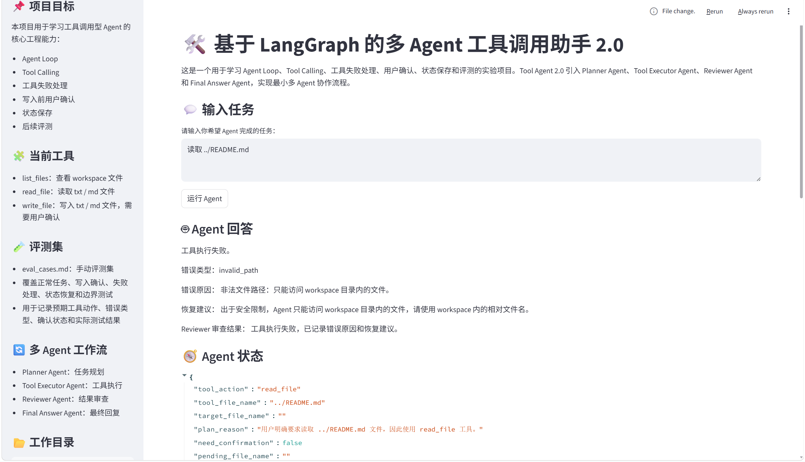
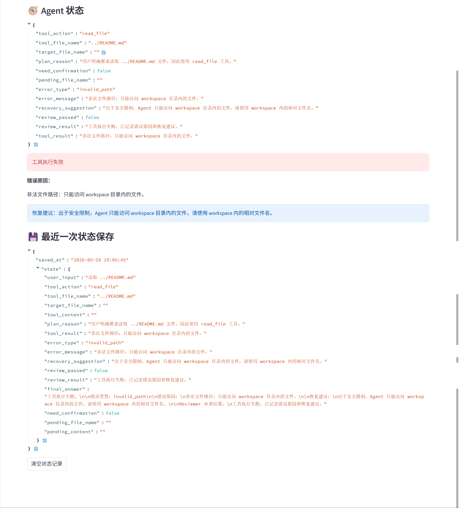

# Tool Agent Assistant

<p align="center">
  
</p>

<p align="center">
  
</p>

一个基于 LangGraph 的文档工作流多 Agent 助手项目，用于学习和实践 Agent Loop、Tool Calling、文档读取、摘要生成、用户确认、状态保存、历史任务和自动化评测等核心工程能力。

本项目不以 RAG 检索为核心，而是重点关注 Agent 如何根据用户任务选择工具、执行工具、处理文档读取与摘要生成，并在涉及写入操作时进行用户确认；在 3.2 版本中，进一步增强文档工作流体验，支持文件名智能匹配、写入后摘要预览和生成文件下载。

---

## 一、项目简介

Tool Agent Assistant 是一个面向 Agent 工程学习的实验项目。

系统基于 LangGraph 构建文档工作流多 Agent 流程，通过 Streamlit 提供可视化页面，支持用户上传文档、选择摘要模板、输入自然语言任务，由 Planner Agent 规划任务，Tool Executor Agent 执行工具，Reviewer Agent 审查结果，Final Answer Agent 生成最终回复。

当前版本已支持：

- 查看 `workspace` 目录文件
- 上传文件到 `workspace`
- 读取 `.txt` / `.md` / `.pdf` / `.docx` 文件
- 根据摘要模板生成 Markdown 摘要
- 根据关键词智能匹配 workspace 文件名
- 根据已有文件生成新 Markdown 文件
- 写文件前要求用户确认
- 用户确认后才真正写入文件
- 写入后在页面直接预览生成内容并下载
- 保存最近一次 Agent 执行状态
- 文件不存在时给出可用文件建议
- 非法路径访问时进行安全拦截
- 不支持格式时给出明确提示
- 失败后展示错误原因和恢复建议
- 多角色节点协作完成规划、执行、审查和回复
- 记录历史任务并支持自动化评测

---

## 二、项目目标

本项目主要用于学习以下 Agent 工程能力：

- Agent Loop：理解 Agent 如何从用户输入到规划、执行、反馈
- Tool Calling：让 Agent 根据任务调用不同工具
- 工具失败处理：对文件不存在、路径非法、格式不支持等情况进行处理
- 用户确认：写文件等高风险操作必须经过用户确认
- 状态保存：将最近一次执行状态保存到本地 JSON 文件
- 后续评测：为后续构建 Agent 评测集打基础

---


## 三、当前版本

当前项目版本：

```text
Tool Agent 3.2
```

版本能力：

```text
Tool Agent 1.0：文件查看、文件读取、基础写入确认、状态保存
Tool Agent 1.1：新增 read_then_write 复合流程，支持根据源文件生成目标文件，并在写入前等待用户确认
Tool Agent 1.2：工具失败处理增强，支持文件不存在、非法路径、不支持格式等错误识别，并提供错误原因和恢复建议
Tool Agent 1.3：状态恢复与任务继续，支持页面刷新后恢复上一次未完成的写入确认任务，并支持清空状态记录
Tool Agent 1.4：新增手动评测集 eval_cases.md，用于记录测试问题、预期工具动作、预期错误类型、预期确认状态和实际测试结果
Tool Agent 2.0：最小多 Agent 工作流，将任务规划、工具执行、结果审查和最终回复拆分为 Planner Agent、Tool Executor Agent、Reviewer Agent 和 Final Answer Agent。
Tool Agent 3.0：文档工作流多 Agent 助手，支持文件上传、PDF/DOCX/TXT/MD 读取、自动摘要模板、历史任务列表和自动化评测脚本。
Tool Agent 3.1：文件名智能匹配，支持根据用户输入关键词自动匹配 workspace 中的文件。
Tool Agent 3.2：写入后摘要预览与下载，用户确认写入后可直接在页面查看生成内容并下载。
```

---

## 四、功能特性

### 1. 查看工作目录文件

用户可以输入：

```text
查看 workspace 里有哪些文件
```

Agent 会调用：

```text
list_files_tool
```

并返回 `workspace` 目录下的文件列表。

---

### 2. 读取文件内容

用户可以输入：

```text
读取 notes.md
```

Agent 会调用：

```text
read_file_tool
```

读取 `workspace/notes.md` 文件内容，并生成简洁回答。

---

### 3. 根据文件生成新文件

用户可以输入：

```text
请根据 notes.md 的内容生成 summary.md
```

Agent 会执行复合流程：

```text
读取 notes.md
↓
根据 notes.md 内容生成 summary.md 内容
↓
进入待确认写入状态
↓
用户点击确认后写入 summary.md
```

该流程对应：

```text
read_then_write
```

---

### 4. 写文件前用户确认

当 Agent 判断任务涉及写文件时，不会直接写入，而是先生成待写入内容，并在页面中展示：

```text
待确认写入操作
文件名
待写入内容预览
确认写入文件按钮
```

用户点击确认后，系统才会真正调用：

```text
write_file_tool
```

完成文件写入。

---

### 5. 状态保存

每次 Agent 执行后，系统会将最近一次状态保存到：

```text
memory/session_state.json
```

状态内容包括：

```text
user_input
tool_action
tool_file_name
target_file_name
plan_reason
summary_template
history_id
generated_file_name
tool_result
error_type
error_message
recovery_suggestion
review_passed
review_result
final_answer
need_confirmation
pending_file_name
pending_content
```

这样可以观察 Agent Loop 的执行过程，也方便后续做会话恢复和评测分析。

---

### 6. 状态恢复与任务继续

Tool Agent 1.3 新增了状态恢复能力。

核心能力：

```text
1. 状态恢复能力
2. 未完成写入任务检测
3. 恢复未完成任务
4. 清空未完成任务
5. 清空状态记录
6. 适合学习 Agent 状态保存与恢复机制
```

当上一次 Agent 执行后仍处于 `need_confirmation = true`，并且状态中存在 `pending_file_name` 和 `pending_content` 时，页面刷新后会在顶部提示：

```text
检测到上一次有未完成的写入确认任务。
```

用户可以选择恢复该任务，继续确认写入；也可以清空未完成任务，删除本地状态记录。

---

### 7. 工具失败处理增强

Tool Agent 1.2 增强了工具失败处理能力。

当用户输入不存在的文件时，例如：

```text
读取 not_exist.md
```

系统会返回：

```text
文件不存在：not_exist.md

当前 workspace 中可用文件：
- notes.md
- summary.md

请检查文件名是否输入正确。
```

当用户尝试访问 workspace 外部路径时，例如：

```text
读取 ../README.md
```

系统会拒绝访问，并提示：

```text
非法文件路径：只能访问 workspace 目录内的文件。
```

当用户读取或写入不支持的文件格式时，系统会提示当前仅支持：

```text
.txt
.md
```

同时，Agent 状态中会记录：

```text
error_type
error_message
recovery_suggestion
```

用于展示错误类型、错误原因和恢复建议。
---

### 8. 手动评测集与测试记录

Tool Agent 1.4 新增了手动评测集：

```text
eval_cases.md
```

该文件用于记录 Agent 在不同任务场景下的预期行为和实际测试结果。

评测覆盖：

```text
正常任务
写入确认
失败处理
状态恢复
边界测试
```

每个测试用例记录：

```text
测试编号
测试类型
用户输入
预期 tool_action
预期 error_type
预期 need_confirmation
预期结果
实际结果
是否通过
备注
```

通过该评测集，可以在后续修改 Agent 逻辑后，检查系统是否出现能力退化。

---

### 9. 多 Agent 工作流

Tool Agent 2.0 将原来的单 Agent 工作流拆分为四个角色节点：

```text
Planner Agent：负责理解用户任务并选择工具动作。
Tool Executor Agent：负责执行本地文件工具。
Reviewer Agent：负责检查工具执行结果、错误状态和写入确认状态。
Final Answer Agent：负责根据工具结果和审查结果生成最终回复。
```

这里的多 Agent 是 LangGraph 中的多角色节点协作，不需要多个 API Key，也不引入新的模型服务。

---

### 10. 文档工作流能力

Tool Agent 3.0 新增文档工作流能力：

```text
上传文件到 workspace
读取 PDF / DOCX / TXT / MD
自动摘要模板
历史任务列表
自动化评测脚本
多 Agent 文档工作流
```

当前支持的摘要模板：

```text
general：通用摘要
meeting：会议纪要
paper：论文摘要
contract：合同摘要
resume：简历分析
project_readme：项目 README 摘要
```

摘要类任务不会自动写入文件，而是先生成待写入的 Markdown 摘要内容，等待用户在页面点击“确认写入文件”。


---

### 11. 文件名智能匹配与写入后预览

Tool Agent 3.2 新增文件名智能匹配能力。用户不必总是输入完整文件名，可以输入关键词：

```text
总结简历
总结合同
总结 notes
```

系统会尝试在 `workspace` 中自动匹配文件，例如：

```text
“总结简历” → 李鹏_简历.pdf
“总结合同” → 案例_入职填写劳动合同(1).pdf
```

如果匹配到多个候选文件，系统会列出候选列表，并要求用户输入更明确的文件名。

用户点击“确认写入文件”后，页面会显示“最近生成内容预览”，可以直接查看生成的 Markdown 摘要内容，并通过“下载生成文件”按钮下载 `.md` 文件。


---

## 五、技术栈

- Python
- Streamlit
- LangGraph
- LangChain
- langchain-openai
- DeepSeek API
- python-dotenv
- pypdf
- python-docx
- JSON 状态保存

---

## 六、系统流程

```text
用户输入任务
↓
用户上传文件
↓
文件保存到 workspace
↓
用户选择或输入任务
↓
Planner Agent 判断任务类型和摘要模板
↓
Tool Executor Agent 读取文档内容
↓
Summary Agent / Final Answer Agent 生成摘要或回答
↓
Reviewer Agent 审查结果、错误状态和是否需要确认
↓
用户确认后写入摘要文件
↓
保存 Agent 状态
↓
记录历史任务
↓
支持自动化评测
↓
页面展示结果
```

---

## 七、Agent 工作流

当前 LangGraph 工作流由四个角色节点组成：

```text
planner_agent_node
↓
tool_executor_agent_node
↓
reviewer_agent_node
↓
final_answer_node
↓
END
```

### Planner Agent

负责理解用户任务并选择工具动作，同时生成 `plan_reason` 说明规划原因。

支持的动作包括：

```text
list_files
read_file
write_file
read_then_write
summarize_file
file_detail
chat
```

### Tool Executor Agent

负责执行工具调用，并识别工具失败情况。

例如：

- `list_files`：查看文件列表
- `read_file`：读取文件
- `write_file`：进入待确认写入流程
- `read_then_write`：先读源文件，再生成目标文件内容，并等待用户确认
- `summarize_file`：先读文档，再按摘要模板生成 Markdown 摘要，并等待用户确认
- `file_detail`：查看文件名、大小、修改时间和格式

Tool Executor Agent 保留 Tool Agent 1.2 的错误识别能力：

```text
file_not_found
invalid_path
unsupported_format
empty_file_name
multiple_matches
```

### Reviewer Agent

负责检查工具执行结果、错误状态和写入确认状态。

审查结果会写入：

```text
review_passed
review_result
```

如果工具执行失败，`review_passed = false`；如果写入任务进入用户确认流程，`review_passed = true`，并说明尚未实际写入文件。

### Final Answer Agent

负责根据工具结果和审查结果生成用户可读回答，并保存当前 Agent 状态。

如果工具执行失败，Final Answer Agent 会输出：

```text
工具执行失败
错误类型
错误原因
恢复建议
Reviewer 审查结果
```

---

## 八、工具列表

当前工具定义在：

```text
tools.py
```

### list_files_tool

功能：

```text
列出 workspace 目录下的文件
```

### read_file_tool

功能：

```text
读取 workspace 目录下的 .txt / .md / .pdf / .docx 文件
支持根据关键词智能匹配文件名
```

限制：

```text
只能读取 workspace 目录内的文件
只支持 .txt、.md、.pdf 和 .docx 文件
```

失败处理：

```text
文件不存在时展示 workspace 中可用文件
非法路径时拒绝访问
多候选匹配时提示候选文件列表
不支持格式时提示仅支持 .txt、.md、.pdf 和 .docx
```

### write_file_tool

功能：

```text
写入 .txt / .md 文件到 workspace 目录
```

限制：

```text
只能写入 workspace 目录内的文件
只支持 .txt 和 .md 文件
写入前必须经过用户确认
```

失败处理：

```text
非法路径时拒绝写入
不支持格式时提示仅支持 .txt 和 .md
```

### get_available_files

功能：

```text
返回 workspace 目录下的所有可用文件名
```

主要用于文件不存在时给用户提供可选文件建议。

### format_available_files_suggestion

功能：

```text
格式化 workspace 可用文件列表
```

示例：

```text
当前 workspace 中可用文件：
- notes.md
- summary.md

请检查文件名是否输入正确。
```

---

## 九、安全设计

为了避免 Agent 误读写系统文件，项目中加入了路径限制：

```text
所有文件操作只能发生在 workspace 目录内
```

如果用户尝试访问上级目录或系统路径，系统会拒绝操作。

例如：

```text
读取 ../README.md
```

会被识别为：

```text
invalid_path
```

并返回：

```text
非法文件路径：只能访问 workspace 目录内的文件。
```

这体现了 Agent 工具调用中的一个重要原则：

```text
工具能力必须有边界，不能让模型随意操作系统文件
```

---

## 十、错误类型设计

Tool Agent 1.2 新增了错误状态字段：

```text
error_type
error_message
recovery_suggestion
```

### error_type

用于表示错误类型。

当前支持：

```text
none
file_not_found
invalid_path
unsupported_format
empty_file_name
multiple_matches
```

### error_message

用于记录具体错误原因。

示例：

```text
文件不存在：not_exist.md
```

### recovery_suggestion

用于给用户提供下一步建议。

示例：

```text
请检查文件名是否正确，或先使用“查看 workspace 里有哪些文件”。
```

---

## 十一、项目结构

```text
tool_agent_assistant
├── assets/
│   └── images/             # README 截图资源
├── app.py                 # Streamlit 页面入口
├── agent.py               # LangGraph Agent 工作流
├── tools.py               # 本地文件工具函数
├── README.md              # 项目说明
├── eval_cases.md          # 手动评测集与测试记录
├── eval_cases.json        # 自动化评测用例
├── run_eval.py            # 自动化评测脚本
├── requirements.txt       # Python 依赖
├── .env.example           # 环境变量示例
├── .gitignore             # Git 忽略配置
├── workspace/             # Agent 可操作的工作目录
│   ├── notes.md
│   └── summary.md
└── memory/                # 状态保存目录
    └── session_state.json
    └── history.jsonl
```

---

## 十二、环境变量配置

项目根目录新建 `.env` 文件：

```env
OPENAI_API_KEY=your_api_key_here
OPENAI_BASE_URL=https://api.deepseek.com
MODEL_NAME=deepseek-chat
```

说明：

```text
.env 文件包含 API Key，不应提交到 GitHub
.env.example 用于展示配置格式，可以提交
```

---

## 十三、运行方式

### 1. 创建虚拟环境

```bash
python -m venv .venv
```

### 2. 激活虚拟环境

Windows PowerShell：

```bash
.\.venv\Scripts\Activate.ps1
```

如果遇到执行策略限制：

```bash
Set-ExecutionPolicy -Scope Process -ExecutionPolicy RemoteSigned
.\.venv\Scripts\Activate.ps1
```

### 3. 安装依赖

```bash
pip install -r requirements.txt
```

### 4. 启动项目

```bash
streamlit run app.py --server.port 8502
```

浏览器访问：

```text
http://localhost:8502
```

### 5. 运行自动化评测

```bash
python run_eval.py
```

评测脚本会读取：

```text
eval_cases.json
```

并生成：

```text
eval_results.md
```

---

## 十四、测试示例

### 测试 1：查看文件

输入：

```text
查看 workspace 里有哪些文件
```

预期：

```text
Agent 调用 list_files_tool，并返回 notes.md、summary.md 等文件
error_type = none
```

---

### 测试 2：读取文件

输入：

```text
读取 notes.md
```

预期：

```text
Agent 调用 read_file_tool，读取 notes.md 内容并回答
error_type = none
```

---

### 测试 3：根据文件生成新文件

输入：

```text
请根据 notes.md 的内容生成 summary.md
```

预期：

```text
Agent 调用 read_then_write
读取 notes.md
生成 summary.md 内容
进入待确认写入状态
need_confirmation = true
pending_file_name = summary.md
error_type = none
```

点击：

```text
确认写入文件
```

预期：

```text
workspace 目录生成或更新 summary.md
状态更新为 write_file_confirmed
need_confirmation 为 false
```

---

### 测试 4：读取不存在的文件

输入：

```text
读取 not_exist.md
```

预期：

```text
error_type = file_not_found
need_confirmation = false
pending_file_name = ""
页面显示错误原因和恢复建议
展示 workspace 中可用文件
```

---

### 测试 5：读取非法路径

输入：

```text
读取 ../README.md
```

预期：

```text
error_type = invalid_path
need_confirmation = false
页面提示只能访问 workspace 目录内文件
```

---

### 测试 6：根据不存在文件生成新文件

输入：

```text
请根据 not_exist.md 的内容生成 summary.md
```

预期：

```text
tool_action = read_then_write
error_type = file_not_found
need_confirmation = false
pending_file_name = ""
pending_content = ""
不会出现确认写入按钮
```

---

## 十五、评测集说明

Tool Agent 1.4 新增的手动评测集在 Tool Agent 3.0 中继续可用：

```text
eval_cases.md
```

该文件用于手动评测 Agent 的关键能力。

当前评测集包含 15 个测试用例，覆盖以下类型：

```text
正常任务
写入确认
失败处理
状态恢复
边界测试
```

示例测试项：

```text
Case 001：查看 workspace 文件
Case 002：读取 notes.md
Case 004：根据 notes.md 生成 summary.md
Case 006：读取不存在文件 not_exist.md
Case 007：读取非法路径 ../README.md
Case 010：刷新页面后恢复未完成写入任务
```

评测字段包括：

```text
用户输入
预期 tool_action
预期 error_type
预期 need_confirmation
预期结果
实际结果
是否通过
备注
```

通过该评测集，可以验证 Agent 在工具调用、失败处理、用户确认和状态恢复等关键流程下是否表现稳定。

Tool Agent 3.0 评测时，还可以额外关注：

```text
plan_reason 是否合理
review_passed 是否正确
review_result 是否能说明审查结果
原有 tool_action / error_type / need_confirmation 是否保持稳定
文件上传是否成功保存到 workspace
PDF / DOCX 是否能正确读取
summarize_file 是否能生成摘要
summary_template 是否正确识别
history.jsonl 是否记录任务
run_eval.py 是否能生成 eval_results.md
```

Tool Agent 3.2 评测时，还可以额外关注：

```text
输入关键词能否自动匹配文件名
多候选文件时是否提示候选列表
确认写入后是否直接显示摘要预览
是否可以下载生成的 summary.md
```

---

## 十六、当前已实现能力


```text
✅ Agent Loop
✅ Tool Calling
✅ 文件列表查看
✅ 文件读取
✅ 根据源文件生成目标文件
✅ 写文件前用户确认
✅ 用户确认后写入文件
✅ 状态保存
✅ 页面刷新后检测未完成写入确认任务
✅ 恢复未完成任务
✅ 清空未完成任务
✅ 清空状态记录
✅ 确认写入后的状态更新
✅ workspace 文件操作安全边界
✅ 文件不存在错误识别
✅ 文件不存在时展示可用文件建议
✅ 非法路径访问拦截
✅ 不支持格式提示
✅ 错误原因记录
✅ 恢复建议展示
✅ read_then_write 源文件失败时自动停止流程
✅ 手动评测集 eval_cases.md
✅ 测试用例覆盖正常任务、写入确认、失败处理、状态恢复和边界测试
✅ 支持记录预期 tool_action、error_type 和 need_confirmation
✅ 支持记录实际结果、是否通过和备注
✅ 最小多 Agent 工作流
✅ Planner Agent 任务规划
✅ Tool Executor Agent 工具执行
✅ Reviewer Agent 结果审查
✅ Final Answer Agent 最终回复
✅ 记录 plan_reason、review_passed 和 review_result
✅ 文件上传到 workspace
✅ 读取 txt / md / pdf / docx
✅ 自动摘要模板
✅ 文件名智能匹配
✅ 多候选文件提示
✅ 写入后摘要预览
✅ 下载生成文件
✅ 历史任务列表
✅ 自动化评测脚本
```

---


## 十七、后续优化方向

### Tool Agent 1.2：工具失败处理增强【已完成】

已实现：

```text
文件不存在时给出可用文件建议
非法路径访问时明确拒绝
不支持格式时提示支持 .txt / .md
记录 error_type、error_message、recovery_suggestion
失败后给出恢复建议
```

### Tool Agent 1.3：状态恢复与任务继续【已完成】

已实现：

```text
读取上一次 pending 状态
页面支持继续上一次未完成任务
支持清空未完成任务
支持清空状态记录
```

### Tool Agent 1.4：评测集与测试记录【已完成】

已实现：

```text
新增 eval_cases.md 手动评测集
记录测试问题、预期工具、预期错误类型、预期确认状态
覆盖正常任务、失败任务、边界任务和用户确认任务
支持记录实际结果、是否通过和备注
```

### Tool Agent 2.0：最小多 Agent 工作流【已完成】

已实现：

```text
Planner Agent
Tool Executor Agent
Reviewer Agent
Final Answer Agent
记录 plan_reason、review_passed、review_result
```

### Tool Agent 3.0：文档工作流多 Agent 助手【已完成】

已实现：

```text
文件上传到 workspace
PDF / DOCX / TXT / MD 读取
自动摘要模板
历史任务列表
自动化评测脚本
```

### Tool Agent 3.1：文件名智能匹配【已完成】

已实现：

```text
根据用户输入关键词匹配 workspace 文件
支持“总结 notes”“总结简历”“总结合同”等自然语言输入
多候选文件时提示候选列表
保持非法路径访问拦截
```

### Tool Agent 3.2：写入后摘要预览与下载【已完成】

已实现：

```text
确认写入文件后在页面展示最近生成内容预览
提供“下载生成文件”按钮
支持清空最近生成预览
继续保留写入前用户确认流程
```
---

## 十八、项目定位

本项目不是普通聊天机器人，而是一个用于学习 Agent 工程机制的工具调用型 Agent 项目。

它重点体现：

```text
模型不只是生成文本，而是能够根据任务选择工具、调用工具、处理结果，并在高风险操作前等待用户确认。
```

与 RAG 知识库项目相比，本项目更关注：

```text
工具调用
执行流程
状态管理
用户确认
失败处理
评测设计
```

---

## 十九、简历描述参考

```text
基于 LangGraph 构建文档工作流多 Agent 助手，将任务规划、工具执行、结果审查和最终回复拆分为 Planner Agent、Tool Executor Agent、Reviewer Agent 和 Final Answer Agent。系统支持上传文件到 workspace，读取 PDF/DOCX/TXT/MD 文档，根据关键词智能匹配文件名，按通用摘要、会议纪要、论文摘要、合同摘要、简历分析和项目 README 等模板生成 Markdown 摘要，并实现写入前用户确认、写入后摘要预览下载、状态保存与恢复、历史任务记录和自动化评测。
```
